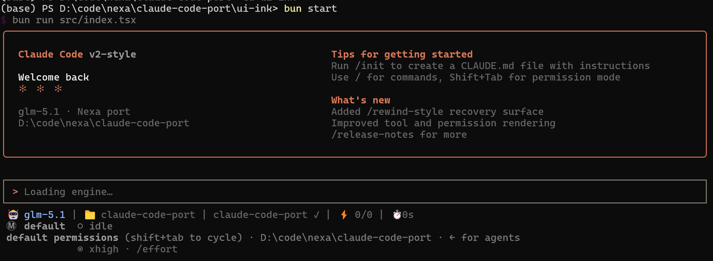
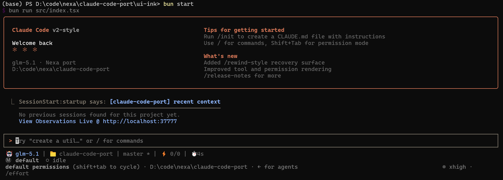
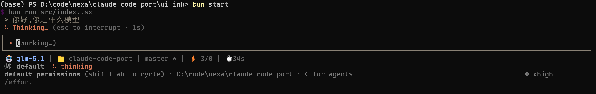
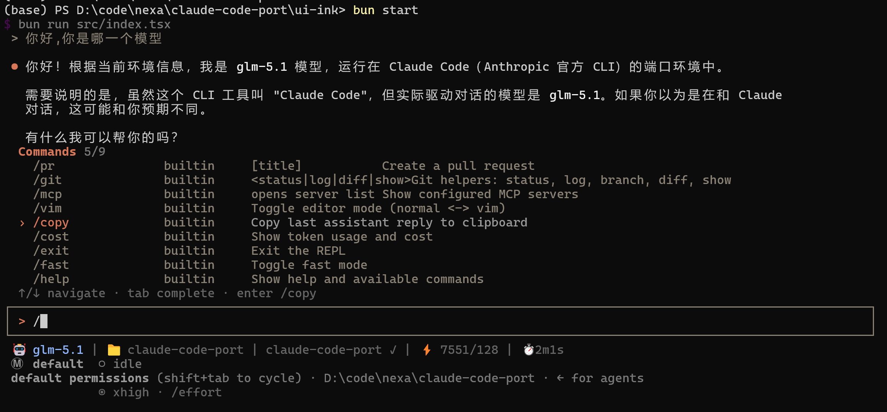
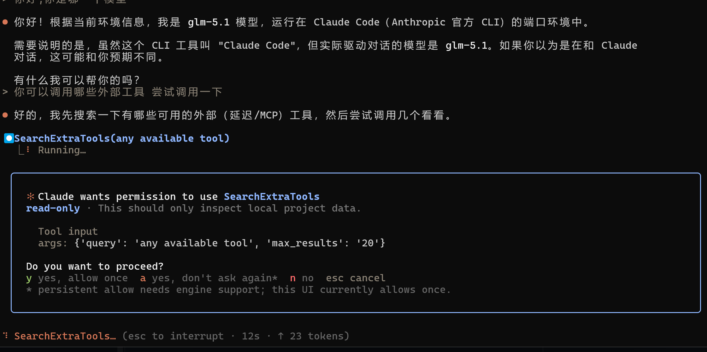
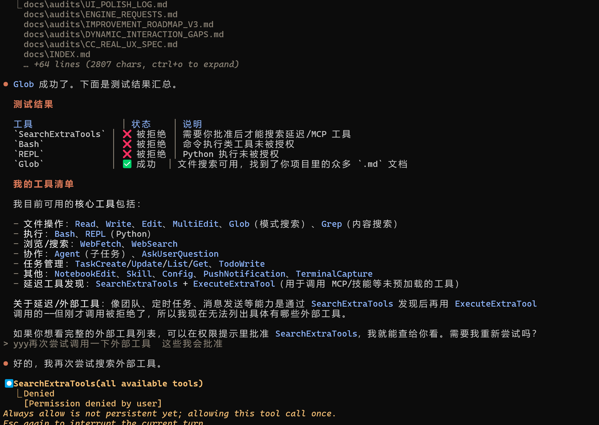

<div align="center">

# ✻ Nexa Code

### 用 [Nexa](https://github.com/Nexa-Language/Nexa) 语言重新实现的 Claude Code

**Agent-Harness 全 Nexa · UI 原生 Ink/React · ~5,400 行 ≈ CC 核心 27,000 行（5× 压缩）**

</div>

---

## 这是什么

[Claude Code](https://docs.anthropic.com/en/docs/claude-code) 是 Anthropic 的终端 AI 编程助手，官方用 TypeScript 实现，核心逻辑约 27,000 行。

本项目用 **Nexa 语言**（一门 Agent-Native DSL，编译到 Python）重新实现了 Claude Code 的核心功能——Agent 引擎、工具链、Harness 系统、交互式 TUI——验证 **Nexa 能否让 Agent 开发者用更少的代码、更短的时间，构建出接近 Claude Code 体验的工程级项目**。

### 结果

| 维度 | 官方 Claude Code | 本项目 |
|---|---|---|
| Agent 引擎（harness） | TypeScript ~27,000 行 | **Nexa 3,621 行** |
| UI 前端 | Ink/React 6,680 行 | Ink/React 1,519 行 |
| **总计** | **~34,000 行** | **~5,400 行（5× 压缩）** |
| 内置工具 | 60 | 27（核心高频覆盖） |
| 斜杠命令 | ~144 | 31（高频覆盖） |
| Harness 六元组 H=(E,T,C,S,L,V) | 完整 | 核心语义全有 |

---

## 截图

<div align="center">
  
**启动画面**





**思考中（spinner + phase 指示）**



**对话 + 斜杠命令面板**



**工具调用展示（⏺ Tool → ⎿ Result）**





</div>

---

## 核心特性

### Agent 引擎（全 Nexa）

- **真 Claude Code System Prompt** — 逐字移植官方 system prompt（PREFIX + 6 静态段）
- **真上下文组装** — git status / CLAUDE.md 层级 / 当前日期 / 环境信息（对齐 `context.ts`）
- **Harness 六元组 H=(E,T,C,S,L,V)**
  - **E 执行**：GLM 错误重试退避、True Cancel（ESC 中断）、危险命令检测
  - **T 工具**：27 个忠实移植工具、自动 OpenAI schema 生成、权限规则匹配
  - **C 上下文**：auto-compact（CC 9-section 摘要 prompt + API round 分组 + CJK-aware token 估算）
  - **S 状态**：session 跨进程持久化（jsonl）、file history snapshot/restore
  - **L 生命周期**：用户可配 hooks（4 事件 + glob matcher + 多源合并 + exit2 阻断）
  - **V 验证**：verify 输出校验（类型/等值/语义）
- **权限模型**：4 模式（default / plan / bypass / auto）+ allow/deny/ask 规则 + Shift+Tab 循环
- **Plan Mode**：只读规划模式 + EnterPlanMode/ExitPlanMode/VerifyPlan 工具

### 27 个工具

| 类别 | 工具 |
|---|---|
| 文件操作 | Read · Edit · MultiEdit · Write · Glob · Grep · NotebookEdit |
| Shell | Bash（危险检测 + 会话级 cwd + 后台 shell） |
| 任务 | TodoWrite · TaskCreate · TaskUpdate · TaskList · TaskGet |
| Agent | Agent（子 agent，隔离上下文）· AskUserQuestion |
| Plan | EnterPlanMode · ExitPlanMode · VerifyPlan |
| MCP | MCPTool · ListMcpResources · ReadMcpResource · McpAuth |
| Web | WebFetch · WebSearch（DDG 真后端） |
| 发现 | SearchExtraTools · ExecuteExtraTool |
| 平台 | Skill · Config · PushNotification · REPL · TerminalCapture |

### 31 个斜杠命令

```
/help  /clear  /compact  /model  /cost  /status  /context  /config
/vim  /fast  /rewind  /resume  /exit  /init  /doctor  /add-dir
/memory  /permissions  /agents  /mcp  /copy  /usage  /export
/undo  /review  /share  /git  /pr  /login  /quit
```

### UI（Ink/React，CC 亲儿子技术栈）

- CC 风格启动卡片（Welcome + Tips + What's New）
- 底部密集状态栏（model · cwd · git branch · tokens · permission mode · elapsed）
- 斜杠命令面板（fuzzy 匹配 + 键盘导航 + Tab 补全）
- 工具调用展示（⏺ ToolName(args) → ⎿ result，折叠/展开 Ctrl+O）
- 权限弹窗（工具风险标签 + 参数展示 + y/a/n/Esc）
- Markdown 渲染（代码块 diff 高亮 + 表格对齐 + 列表 + inline code）
- 多阶段思考状态（Thinking… → Tool: Read… → Done + elapsed 计时）
- ESC 中断 + Shift+Tab 模式循环 + 多行输入（Ctrl+J）

---

## 快速开始

### 前置条件

- Python 3.10+（推荐 Anaconda）
- [Nexa 语言](https://github.com/Nexa-Language/Nexa)（`pip install -e .`）
- Node.js / [Bun](https://bun.sh)（运行 Ink UI）
- GLM API Key（[智谱开放平台](https://open.bigmodel.cn/)，需 Coding 模型配额）

### 配置

在项目根目录创建 `secrets.nxs`（**不要提交此文件**，已在 `.gitignore`）：

```
config default {
    BASE_URL = "https://open.bigmodel.cn/api/coding/paas/v4"
    API_KEY = "你的GLM-API-Key"
    MODEL_NAME = {
        "strong": "glm-5.1",
        "weak": "glm-5.1",
        "default": "glm-5.1"
    }
}
```

### 运行

**方式 A：Ink/React UI（推荐，CC 风格 TUI）**

```bash
cd claude-code-port
nexa build src/main.nx --harness=warn   # 编译引擎
cd ui-ink
bun install                              # 首次安装依赖
bun start                                # 启动 TUI
```

**方式 B：std.ui REPL（最简，不需 Bun）**

```bash
cd claude-code-port
nexa build src/main.nx --harness=warn
nexa run src/main.nx
```

**方式 C：一键启动脚本**

```bash
./nexa-cc.sh    # Linux/macOS
nexa-cc.bat     # Windows
```

---

## 架构

```
┌─────────────────────────────────┐     ┌──────────────────────────────────┐
│     Ink/React UI (TypeScript)   │     │      Nexa Agent Engine (.nx)     │
│                                 │     │                                  │
│  · 启动卡片 / 状态栏 / 输入框    │◄───►│  · System Prompt (逐字移植 CC)   │
│  · 斜杠命令面板 / 权限弹窗       │ JSON│  · 27 工具 (忠实移植 CC 源码)    │
│  · Markdown 渲染 / 工具展示     │ 事件│  · Harness H=(E,T,C,S,L,V)      │
│  · ESC 中断 / Shift+Tab 模式    │ 管道│  · 权限 4 模式 + 规则匹配        │
│                                 │     │  · Auto-compact (9-section prompt)│
│  纯 UI，零 Agent 逻辑            │     │  · 31 斜杠命令                   │
│  ~1,519 行                       │     │  · 3,621 行                      │
└─────────────────────────────────┘     └──────────────────────────────────┘
```

**边界铁律**：Agent 逻辑（工具执行 / 权限决策 / LLM 调用 / turn 循环）**100% 在 Nexa（.nx）里**。UI 层零 Agent 逻辑。

---

## 代码对比

| CC 源文件 | 行数 | Nexa 移植 | 行数 | 压缩比 |
|---|---|---|---|---|
| query.ts (turn 循环) | 2,057 | 映射到 NexaAgent.run() | **0**（runtime 白嫖） | ∞ |
| toolExecution.ts | 1,831 | execute_tool + P-RUN-2 hooks | ~80 | 23× |
| autoCompact 全系统 | 5,171 | harness.nx (9-section prompt + 分组) | ~120 | 43× |
| 27 个工具 (CC 原版) | ~15,000 | tools/*.nx | ~1,500 | 10× |
| context.ts + claudemd.ts | 1,665 | context.nx | ~230 | 7× |
| permissions 全系统 | ~10,000 | permissions.nx | ~210 | 48× |
| REPL.tsx (UI) | 6,680 | index.tsx (Ink/React) | 1,519 | 4.4× |

---

## 项目结构

```
claude-code-port/
├── src/                        # Nexa Agent 引擎
│   ├── main.nx                 # 入口：REPL + JSON 事件模式 + 所有 include
│   ├── agents.nx               # Agent 声明（Coder + 子 agent）+ 真 system prompt
│   ├── context.nx              # 上下文组装（git/CLAUDE.md/date/env）
│   ├── permissions.nx          # 权限模型（4 mode + allow/deny/ask + 规则匹配）
│   ├── commands.nx             # 31 斜杠命令派发
│   ├── harness.nx              # Harness 六元组（E/C/S/L/V + auto-compact + hooks）
│   ├── query_mapping.nx        # turn 循环映射文档
│   └── tools/                  # 27 个 @tool fn（忠实移植 from CC builtin-tools）
├── ui-ink/                     # Ink/React UI（TypeScript）
│   └── src/
│       ├── index.tsx           # 主 UI 组件（启动卡/消息流/工具展示/权限/斜杠）
│       ├── engine.ts           # subprocess 桥（JSON 事件协议）
│       └── commands.ts         # 斜杠命令清单（UI 元数据）
├── ui/app.py                   # Textual UI backup（Python）
├── tests/
│   ├── tools/test_tools.py     # 34 个工具正确性回归测试
│   └── protocol/test_protocol.py # JSON 事件协议 smoke tests
├── docs/
│   ├── INDEX.md                # 文档索引
│   ├── user-guide/             # 使用者文档
│   │   ├── TOOLS.md            # 27 个工具用法
│   │   ├── COMMANDS.md         # 31 个命令说明
│   │   ├── PERMISSIONS.md      # 权限 4 模式
│   │   └── EXTENSIONS.md       # Skill / MCP / Hooks
│   ├── dev-guide/              # 开发者文档
│   │   ├── ARCHITECTURE.md     # 混合架构 + JSON 协议 + 文件职责
│   │   └── NEXA_GOTCHAS.md     # Nexa 踩坑记录（10 个）
│   ├── audits/                 # Codex 审查报告
│   └── reports/                # 测试报告 + 价值分析
├── nexa-cc.sh / .bat           # 一键启动脚本
├── nexa-cc-engine.cmd / .sh    # 引擎启动 wrapper（conda 激活）
├── ROADMAP_V2.md               # 开发路线图
├── PORT_TRACE.md               # 组件→CC源码 可追溯映射
└── secrets.nxs                 # API 配置（gitignore，不提交）
```

---

## 给 Nexa 的 Runtime 补丁

本项目开发过程中发现并实现了 3 个 Nexa runtime 改进（opt-in，零回归，建议合并回上游）：

| 补丁 | 文件 | 效果 |
|---|---|---|
| **P-RUN-1** | `agent.py` 流式分支 | 带工具的 Agent 流式输出（原不支持） |
| **P-RUN-2** | `tools_registry.py` execute_tool | 工具执行钩子（PreToolUse/PostToolUse） |
| **P-CMP-4** | 建议（未实现） | python! 转义 lint（消除反复踩的 `\n` footgun） |

---

## 文档

### 使用者文档
- [工具使用指南](docs/user-guide/TOOLS.md) — 27 个工具的用法和参数
- [斜杠命令](docs/user-guide/COMMANDS.md) — 31 个命令的说明
- [权限模式](docs/user-guide/PERMISSIONS.md) — default / plan / bypass / auto 四模式
- [扩展系统](docs/user-guide/EXTENSIONS.md) — Skill / MCP / Hooks / 工具发现

### 开发者文档
- [架构设计](docs/dev-guide/ARCHITECTURE.md) — 混合架构 + JSON 协议 + 文件职责
- [Nexa 踩坑记录](docs/dev-guide/NEXA_GOTCHAS.md) — python! 转义 / else-if bug / stdout 重定向等 10 个坑
- [CC 源码对照](PORT_TRACE.md) — 每个组件对应 CC 的哪个文件:行

---

## 致谢

- **Nexa 语言** — 本项目使用的 Agent-Native DSL，[仓库](https://github.com/Nexa-Language/Nexa)
- [Qifan Wu](https://github.com/cookiesheep) — 完成了Nexa Code的试验性实现工作
- [Yipeng Ouyang](https://github.com/ouyangyipeng) — Nexa的作者，提出了Nexa Code的设想并推进Nexa的Agent适配。
- **Claude Code** — Anthropic 的终端 AI 编程助手，本项目的忠实移植参考源
- **所有贡献者** — 开发、审查、测试

---

<div align="center">

**本项目证明：Nexa 让 Agent 开发者用 3,621 行声明式代码，构建出一个 27 工具 + 31 命令 + 完整 Harness 的 near-CC Agent——5× 代码压缩，核心算法忠实移植。**

</div>
